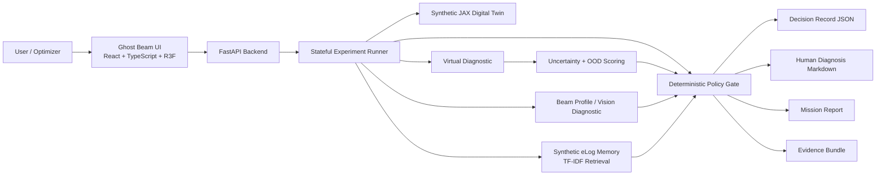
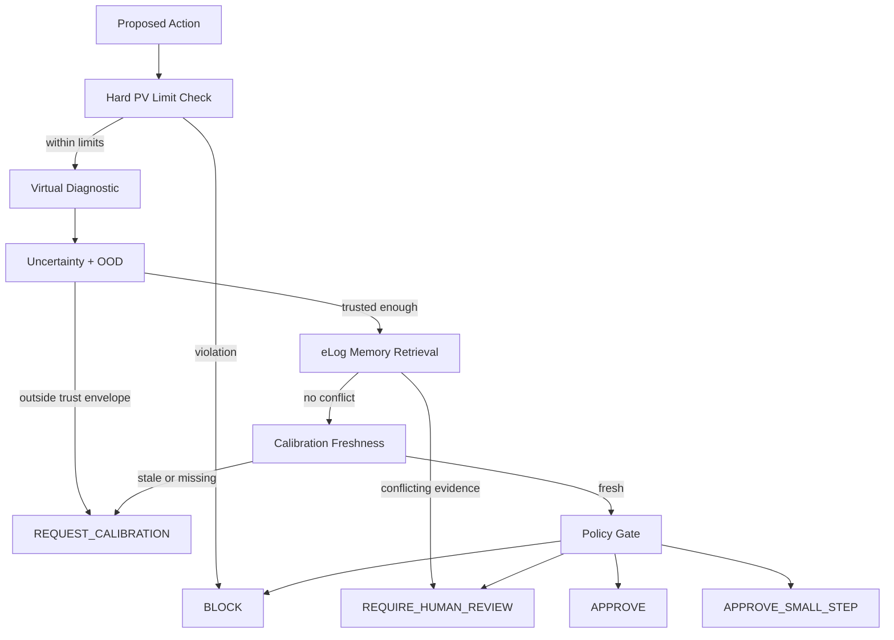
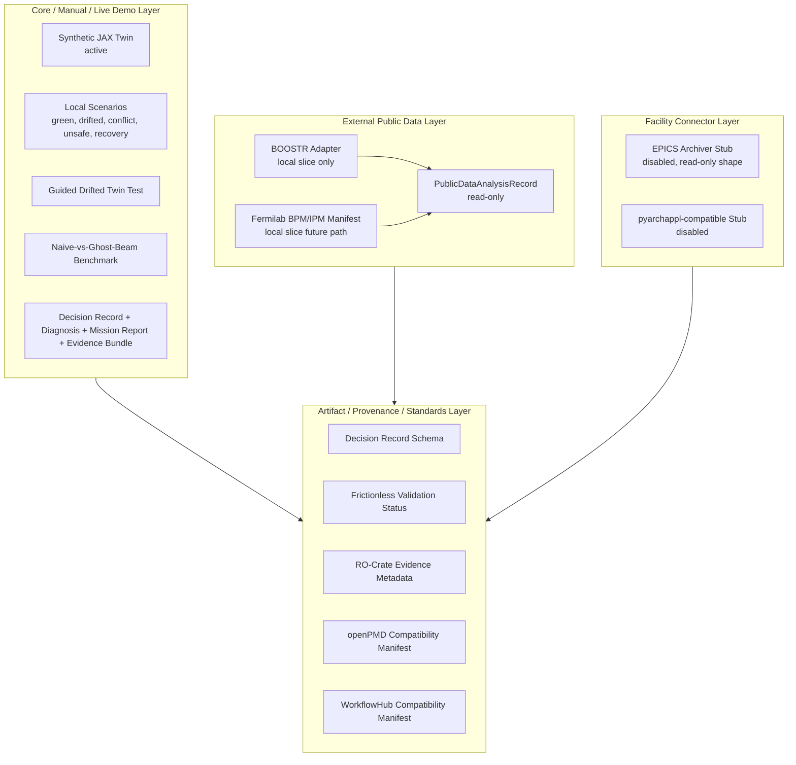
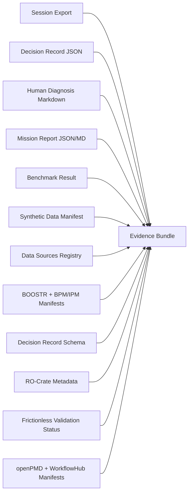

# Ghost Beam

**Accelerator trust agent.**

Ghost Beam gates autonomous accelerator actions using digital-twin trust, uncertainty/OOD scoring, eLog memory, hard safety limits, and evidence-producing policy decisions.


## Opening Story

Accelerator user facilities are entering the Genesis Mission era: digital twins are no longer just visual replicas of machines, but potential operators of scientific infrastructure. Berkeley Lab has described an ALS/ALS-U injector effort where a virtual diagnostic could estimate beam quality without perturbing the beam or interrupting user operations, eventually supporting an agentic assistant that keeps an aging, drifting injector optimized. Ghost Beam starts from the risk hidden inside that vision: if an autonomous optimizer trusts a stale or uncertain twin, it can confidently suggest the wrong machine action. Ghost Beam is a trust-and-memory gate for that moment. It checks digital-twin confidence, uncertainty/OOD, beam diagnostics, historical eLog evidence, hard PV limits, and calibration state before a proposed accelerator action is approved, shrunk, held for review, calibrated, or blocked - producing both a machine-readable Decision Record and a human-readable Diagnosis so labs get safer autonomy, fewer unnecessary interruptions, and a reusable evidence trail.

Ghost Beam is a local, synthetic, no-hardware prototype. It demonstrates the control architecture safely; it does not operate real accelerator hardware.

## The Problem

Autonomous accelerator tools can propose machine actions faster than operators can manually inspect every detail. That speed creates a trust problem:

- Digital twins drift as real machines age, warm up, or move outside their familiar envelope.
- Virtual diagnostics can be uncertain or out-of-distribution.
- Naive optimizers can propose actions that look locally useful but violate limits or worsen beam halo.
- Operator knowledge is often buried in eLogs and does not naturally enter an optimizer loop.
- Destructive or perturbative diagnostics can interrupt user operations.
- Labs need trust gates and evidence trails before autonomy touches the machine.

Ghost Beam is built for that gap.

## What Ghost Beam Does

Ghost Beam sits between an autonomous optimizer and a simulated accelerator control layer. For every proposed action, it checks:

- virtual diagnostic prediction
- model uncertainty
- out-of-distribution score
- beam-profile/vision diagnostic
- synthetic eLog memory
- hard PV limits
- calibration status
- deterministic policy rules

It then returns exactly one gate decision:

| Decision | Meaning |
| --- | --- |
| `APPROVE` | Safe enough to apply in the simulated environment. |
| `APPROVE_SMALL_STEP` | Allowed only as a smaller/safer simulated step. |
| `REQUIRE_HUMAN_REVIEW` | Evidence conflict or policy risk requires operator review. |
| `REQUEST_CALIBRATION` | Twin trust/OOD state is not good enough for an autonomous write. |
| `BLOCK` | Hard limit or unsafe action is rejected. |

Every decision can be exported as a machine-readable Decision Record plus a human-readable Ghost Beam Diagnosis.

## Demo: Drifted Twin Test

The core guided demo is the **Drifted Twin Test**.

1. **Nominal baseline**: L1 Transfer Line begins inside a trusted green operating region.
2. **Drift appears**: the machine moves outside the digital twin's familiar envelope.
3. **Naive proposal**: an optimizer proposes a quadrupole correction that looks plausible for a diffuse beam.
4. **Ghost Beam evaluation**: Ghost Beam checks uncertainty, OOD, beam profile, eLog memory, hard limits, and policy.
5. **eLog evidence**: Ghost Beam retrieves a synthetic eLog warning that similar diffuse-beam symptoms were caused by RF phase drift and that increasing `quad_2` worsened halo.
6. **Calibration**: Ghost Beam requests a calibration measurement instead of trusting a stale twin.
7. **Safer correction**: after calibration improves trust/OOD, Ghost Beam approves a safer correction path rather than blindly applying the naive quadrupole move.
8. **Artifact export**: Ghost Beam exports a Decision Record, Diagnosis, Mission Report, Benchmark, and Evidence Bundle.

Guided Demo is intentionally the Drifted Twin Test. Normal scenario selection remains separate and runs the selected scenario in Live Scenario Mode.

## Architecture



### Decision Flow



### Core vs External Data Architecture



### Evidence Bundle Composition



## Features

- 3D digital twin UI with dark control-room and light inspection themes.
- Guided Drifted Twin Test.
- Live scenario runner for Green Zone, Drifted Twin, eLog Conflict, Unsafe Write, and Calibration Recovery.
- Non-mutating Demo Health Check.
- Decision Record JSON.
- Human-readable Ghost Beam Diagnosis.
- Backend-persisted Mission Report.
- Naive-vs-Ghost-Beam Benchmark.
- Evidence Bundle export.
- Recorded-run fixture and replay.
- Federated data-source registry.
- Public data adapters/manifests.
- Platform readiness/version/adapters/capabilities endpoints.
- Local launch and smoke scripts.
- Local-only safety boundary.

## Screenshots and GIFs

These are the captured release screenshots currently embedded in the README.

### Dark Guided Twin View


### Diagnosis / Evidence Audit Trail


### Light Theme Twin View


### Recommended GIFs to Capture

GIF files are not linked here until they exist. Capture instructions live in [docs/gifs/README.md](docs/gifs/README.md).

| Suggested GIF | What to capture |
| --- | --- |
| `guided_drifted_twin_test.gif` | Guided Demo from Naive Proposal through Calibration and Safer Correction. |
| `decision_record_diagnosis.gif` | Decision Record drawer, Diagnosis tab, evidence timeline, JSON tab. |
| `benchmark_run.gif` | Benchmark run and summary metrics. |
| `evidence_bundle_export.gif` | Evidence Bundle export action. |
| `data_sources_panel.gif` | Settings to Data Sources & Provenance. |

## Data Sources

Ghost Beam keeps the live demo layer separate from external data compatibility.

- **Core demo layer**: synthetic JAX twin, synthetic eLogs, local scenarios, guided demo, benchmark, mission report, diagnosis, and evidence artifacts.
- **External data layer**: read-only public dataset adapters, local-slice importers, facility connector stubs, artifact standards, validation standards, and provenance manifests.

| Data source | Role | Active? | Real/public? | Notes |
| --- | --- | --- | --- | --- |
| Synthetic JAX Digital Twin | Live demo, benchmark, virtual diagnostic training/testing | Yes | Synthetic | Local transfer-matrix environment. Simulated writes only after policy approval. |
| Synthetic eLogs | Operator-memory retrieval | Yes | Synthetic | Local CSV; no real facility logs. |
| Synthetic Recorded Fixture | Deterministic replay and recorded-run ingestion demo | Yes | Synthetic | Local CSV/eLog trace generated by Ghost Beam. |
| BOOSTR | Public accelerator-control dataset adapter | Adapter-ready | Public, local-slice only | DOI `10.5281/zenodo.4382663`; no full dataset bundled or downloaded. |
| Fermilab BPM/IPM | Public beam-position/profile diagnostics manifest | Manifest-ready | Public, local-slice future path | DOI `10.5281/zenodo.17429707`; no files bundled. |
| EPICS Archiver Stub | Future read-only archived PV retrieval connector | Stub disabled | Facility connector shape | Does not connect to any network or live control system. |
| pyarchappl-compatible Stub | Future Python client compatibility layer | Stub disabled | Facility connector shape | Read-only future interface only. |
| openPMD | Future beam-physics artifact compatibility | Manifest-ready | Standard | Included as compatibility manifest only. |
| Frictionless | Tabular validation layer | Active or manifest-ready | Standard | Reports installed/not-installed status without requiring heavy dependency. |
| RO-Crate | Evidence/provenance bundle layer | Active | Standard | Evidence bundle includes RO-Crate-style metadata. |
| WorkflowHub | Future workflow publication/provenance registry compatibility | Manifest-ready | Standard/future extension | Not active in the live control loop. |
| Materials Project | Future Genesis materials context | Manifest-ready | Public/future extension | Not used for accelerator control. No API key or runtime call. |

Registry endpoints:

- `GET /data-sources`
- `GET /data-sources/summary`

## Real vs Simulated

| Real in this repository | Simulated / not real |
| --- | --- |
| FastAPI backend | Accelerator plant |
| Pydantic schemas and Decision Record schema endpoint | EPICS process variables |
| JAX CPU synthetic digital twin | Historical facility eLogs |
| Virtual diagnostic, uncertainty, and OOD scoring | Beam camera / live image stream |
| Synthetic image/beam-profile diagnostic | Calibration screen measurement |
| TF-IDF retrieval over local synthetic eLogs | Proposed optimizer action source |
| Deterministic policy gate | Recorded facility traces |
| Stateful experiment runner | Hardware writes |
| Benchmark, report, and evidence exporters | Facility deployment |
| React/TypeScript/R3F frontend | Safety certification |
| Federated data-source registry | Official institutional endorsement |

## Benchmark

Latest packaging benchmark:

| Metric | Value |
| --- | ---: |
| Trials | 50 |
| Seed | 42 |
| Naive actions applied | 50 |
| Ghost Beam approved | 9 |
| Ghost Beam blocked | 9 |
| Ghost Beam requested calibration | 16 |
| Ghost Beam required human review | 16 |
| Hard-limit violations prevented | 9 |
| eLog conflicts caught | 16 |
| Unsafe actions prevented | 41 |
| Average naive projected quality | 0.6381 |
| Average Ghost Beam projected quality | 0.7038 |
| Average naive projected beam loss | 0.1874 |
| Average Ghost Beam projected beam loss | 0.0206 |
| Average OOD before calibration | 9.7410 |
| Average OOD after calibration | 2.7410 |
| Actions modified or blocked | 82.0% |
| Safe actions allowed | 18.0% |

Short version:

Across 50 deterministic synthetic accelerator-control trials, Ghost Beam prevented or modified 82% of naive actions, blocked 9 unsafe/hard-limit actions, requested calibration in 16 high-OOD cases, caught 16 eLog conflicts, and reduced average projected beam loss from 0.1874 to 0.0206.

## Evidence Artifacts

Ghost Beam exports:

- Decision Record JSON.
- Ghost Beam Diagnosis Markdown.
- Mission Report JSON and Markdown.
- Benchmark JSON.
- Evidence Bundle JSON.
- Data Source Registry.
- Public dataset manifests.
- Synthetic data manifest.
- Decision Record schema.
- RO-Crate-style metadata.
- Frictionless validation status.
- Platform readiness/version metadata.

Evidence Bundle contents are documented in [docs/artifact_schema.md](docs/artifact_schema.md). Local generated evidence bundles are intentionally ignored by git by default.

## Quickstart

Local preview URLs:

- Frontend: `http://127.0.0.1:5173/`
- Backend API: `http://127.0.0.1:8000/`
- API docs: `http://127.0.0.1:8000/docs`
- Health: `http://127.0.0.1:8000/health`

One-command local launch:

```powershell
cd "D:\Building\Ghost Beam"
powershell -ExecutionPolicy Bypass -File .\scripts\start_ghostbeam.ps1
```

Backend:

```powershell
cd "D:\Building\Ghost Beam"
python -m venv .venv
.\.venv\Scripts\Activate.ps1
python -m pip install --upgrade pip
pip install -r requirements.txt
cd backend
python -m pytest tests -q
python -m uvicorn ghostbeam.api.main:app --reload --host 127.0.0.1 --port 8000
```

Frontend:

```powershell
cd "D:\Building\Ghost Beam\frontend"
npm install
npm run dev -- --host 127.0.0.1 --port 5173
```

Smoke test:

```powershell
cd "D:\Building\Ghost Beam"
powershell -ExecutionPolicy Bypass -File .\scripts\run_smoke.ps1
```

## Demo Flow

1. Open `http://127.0.0.1:5173/`.
2. Run Health Check and state that it is non-mutating.
3. Show Live Scenario Mode.
4. Start **Guided: Drifted Twin Test**.
5. Step through Nominal Baseline, Drift Appears, Naive Proposal, Ghost Beam Evaluation, Calibration, Safer Correction, and Export Artifact.
6. Open Decision Record and show the Diagnosis tab.
7. Show the "What Ghost Beam Did" timeline.
8. Generate Mission Report.
9. Run Benchmark.
10. Export Evidence Bundle.
11. Open Settings / Data Sources & Provenance to show the core and external data layers.

Full demo click path: [docs/final_demo_click_path.md](docs/final_demo_click_path.md)

## API Surface

Experiment:

- `GET /experiment/state`
- `POST /experiment/start`
- `POST /experiment/propose`
- `POST /experiment/evaluate`
- `POST /experiment/apply`
- `POST /experiment/calibrate`
- `POST /experiment/export`
- `POST /experiment/health-check`
- `POST /experiment/report/generate`
- `POST /experiment/evidence-bundle`

Benchmark:

- `POST /benchmark/run`
- `GET /benchmark/latest`
- `GET /benchmark/{benchmark_id}`

Platform:

- `GET /health`
- `GET /platform/version`
- `GET /platform/adapters`
- `GET /platform/capabilities`
- `GET /platform/data-manifest`

Data sources:

- `GET /data-sources`
- `GET /data-sources/summary`
- `GET /public-data/sources`
- `POST /public-data/boostr/import-local`
- `POST /public-data/boostr/evaluate-window`
- `GET /recorded-runs`
- `POST /recorded-runs/load`
- `POST /recorded-runs/evaluate-step`

Artifacts:

- `GET /artifacts/schemas/decision-record`
- `POST /experiment/evidence-bundle`

More detail: [docs/api.md](docs/api.md)

## Repository Structure

```text
backend/      FastAPI backend, physics, diagnostics, policy, artifacts, tests
frontend/     React/TypeScript/R3F UI
backend/data/ Synthetic eLogs, scenarios, manifests, recorded fixtures
docs/         API docs, demo docs, diagrams, safety notes, screenshots
scripts/      Local launch, smoke, reset, visual QA helpers
packaging/    Final packaging artifacts and README/demo source material
cad/          CAD/text-to-cad prompts and procedural fallback material
```

## Safety and Scope

Ghost Beam is local-only. It does not:

- connect to real accelerator hardware
- perform EPICS writes
- use real facility eLogs
- ingest live camera feeds
- open public tunnels
- call paid APIs
- upload data externally
- auto-download public datasets
- operate in production
- provide safety certification

The active control adapter is simulated. Public data paths are read-only and local-slice based. Facility connector stubs are disabled.

## Public Data and Standards Compatibility

Ghost Beam includes a federated data-source registry so judges can see how the architecture would expand beyond the synthetic demo without destabilizing the live run.

- **BOOSTR**: public Fermilab Booster accelerator-control dataset adapter, local-slice only. No full dataset is bundled or downloaded.
- **Fermilab BPM/IPM**: public diagnostics dataset manifest for future local-slice analysis.
- **EPICS Archiver**: disabled read-only connector stub for future archived PV windows.
- **pyarchappl-compatible interface**: disabled compatibility stub.
- **openPMD**: future beam-physics artifact compatibility manifest.
- **Frictionless**: tabular validation status for event histories, benchmark tables, and import windows.
- **RO-Crate**: evidence/provenance metadata in the Evidence Bundle.
- **WorkflowHub**: future workflow publication/provenance compatibility manifest.
- **Materials Project**: future Genesis context adapter only; not active in accelerator control.

External data sources cannot apply actions or write to hardware.

## Known Limitations

- All live demo facility data are synthetic.
- Public BOOSTR and Fermilab BPM/IPM datasets are not bundled; users must provide local slices.
- Public-data analysis is read-only and lightweight; it is not a retrained public-data virtual diagnostic.
- EPICS/Archiver connectors are stubs only and do not connect to networks.
- 3D beamline geometry is procedural, not CAD/GLB.
- Vite still warns that the lazy-loaded Three/R3F scene chunk is larger than 500 kB.
- Full projector-width screenshots should still be captured manually before final recording.

## Future Work

- Facility-approved read-only EPICS Archiver integration.
- Facility-trained virtual diagnostics.
- Real facility eLog connector with privacy review.
- Actual local BOOSTR slice example.
- Osprey-compatible pre-action trust-gate wrapper.
- Xopt integration where Xopt proposes and Ghost Beam gates.
- openPMD/openPMD-beamphysics import/export.
- Signed evidence bundles and stronger RO-Crate generation.
- CAD/GLB hardware assets.
- Full external projector QA and final screen recording.

## Copyright and Use Restrictions

Copyright © 2026 Ziauddin Sherkar. All rights reserved.

Ghost Beam is proprietary software and documentation. No license is granted. You may not use, copy, modify, distribute, publish, host, deploy, commercialize, train models on, benchmark, reverse engineer, or create derivative works from this project without prior express written permission from Ziauddin Sherkar.

This repository is provided only for review and evaluation through GitHub. It is not open source. See [LICENSE](LICENSE), [COPYRIGHT.md](COPYRIGHT.md), [NOTICE.md](NOTICE.md), and [docs/legal_notice.md](docs/legal_notice.md).

## Safety and Affiliation Disclaimer

Ghost Beam is an independent hackathon prototype. It is not affiliated with, sponsored by, approved by, or endorsed by the U.S. Department of Energy, Lawrence Berkeley National Laboratory, Berkeley Lab, Advanced Light Source, ALS-U, Fermilab, SLAC, EPICS, Osprey, Materials Project, or any other third-party institution.

The system is local-only and synthetic. It does not connect to real accelerator hardware, perform EPICS writes, use real facility eLogs, ingest live camera feeds, open public tunnels, call paid APIs, upload data externally, or auto-download public datasets.

Ghost Beam is not safety-certified and must not be used in real control-room, laboratory, industrial, medical, energy, semiconductor, or safety-critical environments.

## Disclaimer

The Materials are provided for review and evaluation only. They are provided "AS IS" without warranty of any kind, express or implied. No patent license, trademark license, safety certification, public dataset rights, or third-party endorsement is granted or implied.
