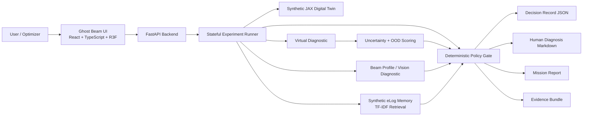
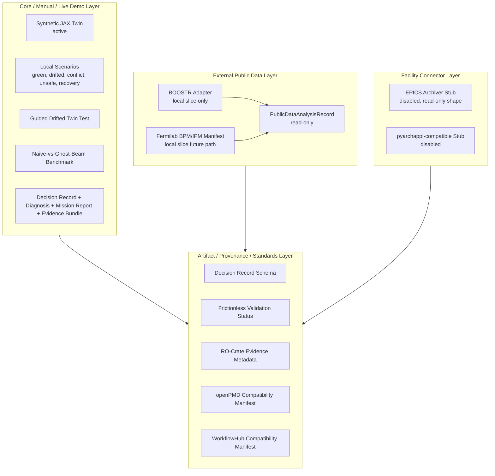
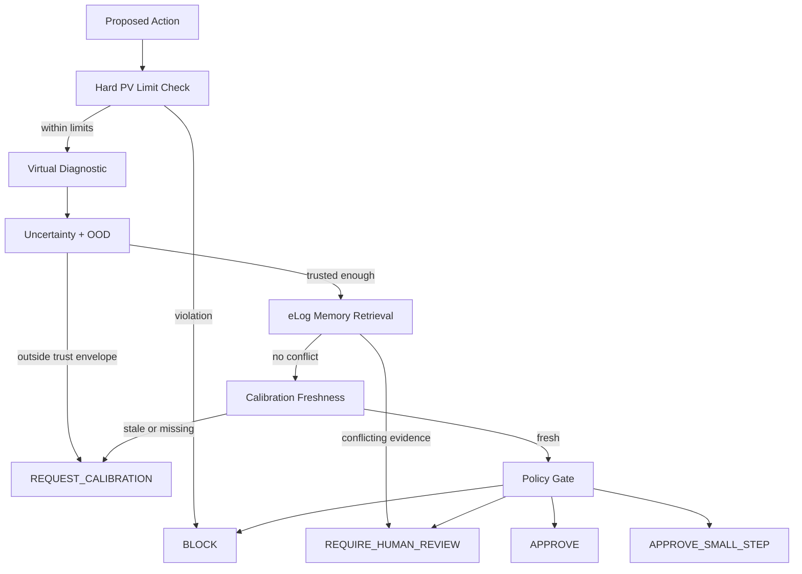
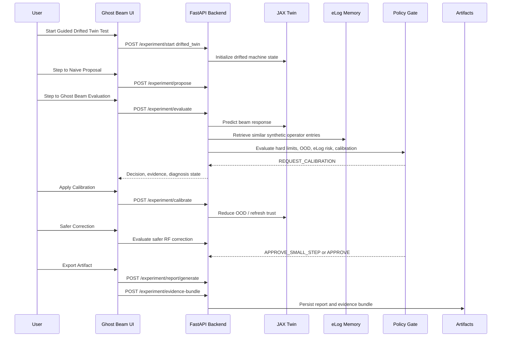
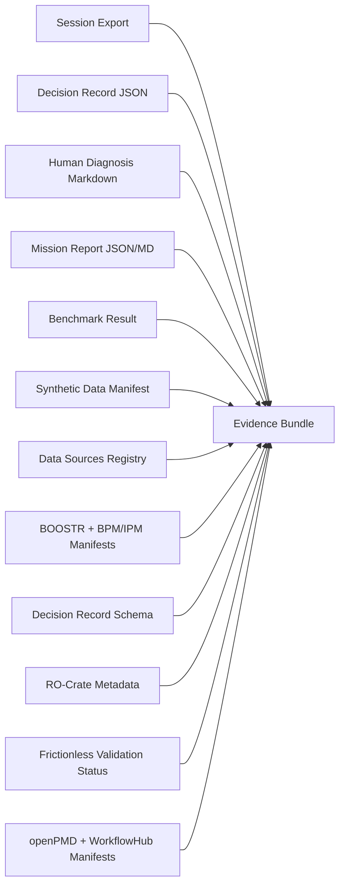
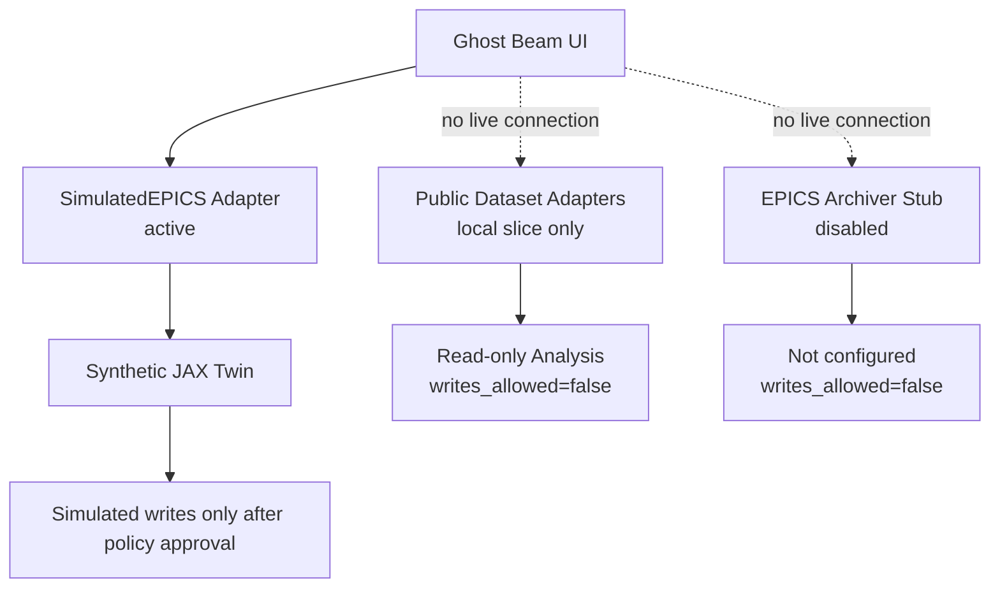

# Ghost Beam Architecture Diagram Source

These Mermaid diagrams are designed to be pasted into a README, GitHub issue, slide generator, or documentation site.

## 1. System Architecture

## 2. Core vs External Data Architecture

## 3. Decision Flow

## 4. Guided Drifted Twin Test Sequence

## 5. Evidence Bundle Composition

## 6. Safety Boundary Diagram

